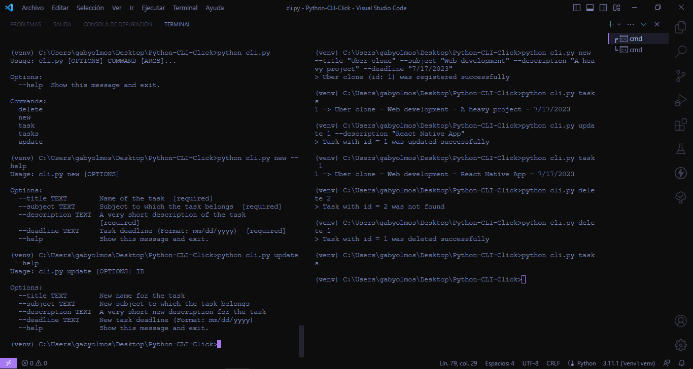

# Python CLI

This is a simple example of a small CLI (Command line interface) built with Python and a Python module called "click". This CLI allows us to make a CRUD working with tasks where we can set a title, a related subject, a very short description and a deadline. 
This project is based on [Fazt](https://youtu.be/4zenT23rZFM), a great YouTube Channel related to programming.

*Note: Venv (python internal module) was used as virtual enviroment*

### Preview
